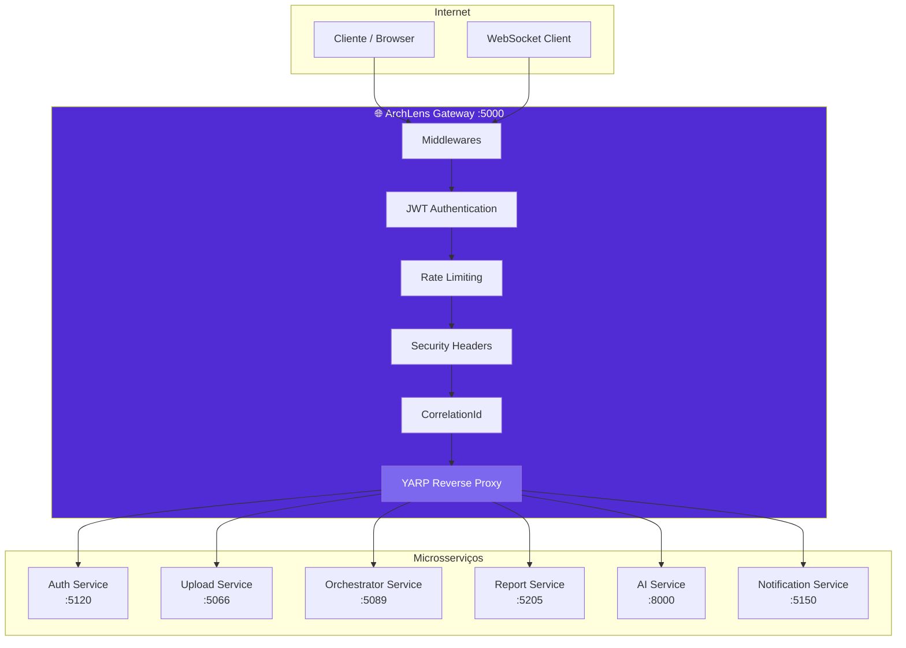
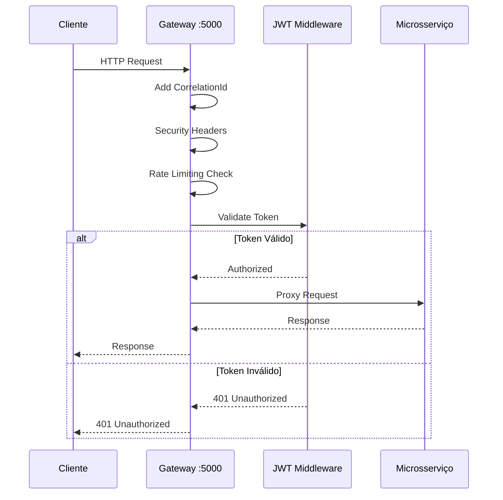
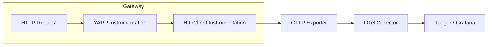

# 🌐 ArchLens - API Gateway

[](https://github.com/archlens-platform/archlens-gateway/actions/workflows/ci.yml)
[](https://sonarcloud.io/summary/new_code?id=archlens-platform_archlens-gateway)
[](https://sonarcloud.io/summary/new_code?id=archlens-platform_archlens-gateway)
[](https://sonarcloud.io/summary/new_code?id=archlens-platform_archlens-gateway)
[](https://sonarcloud.io/summary/new_code?id=archlens-platform_archlens-gateway)
[](https://sonarcloud.io/summary/new_code?id=archlens-platform_archlens-gateway)
[](https://sonarcloud.io/summary/new_code?id=archlens-platform_archlens-gateway)
[](https://sonarcloud.io/summary/new_code?id=archlens-platform_archlens-gateway)

> **Reverse Proxy e Gateway de API com YARP**
> Hackathon FIAP - Fase 5 | Pós-Tech Software Architecture + IA para Devs
>
> **Autor:** Rafael Henrique Barbosa Pereira (RM366243)

[](https://dotnet.microsoft.com/)
[](https://microsoft.github.io/reverse-proxy/)
[](https://jwt.io/)
[](https://www.docker.com/)

---

## 📋 Descrição

O **ArchLens Gateway** é o ponto de entrada único da plataforma ArchLens, implementado com **YARP (Yet Another Reverse Proxy)** sobre .NET 9. Centraliza autenticação JWT, autorização baseada em roles, rate limiting, headers de segurança e correlação de requests para todos os microsserviços do ecossistema.

---

## 🏗️ Arquitetura



---

## 🔄 Fluxo de Request



---

## 🛠️ Tecnologias

| Tecnologia | Versão | Descrição |
|------------|--------|-----------|
| .NET | 9.0 | Framework principal |
| YARP | 2.x | Reverse Proxy |
| JWT Bearer | - | Autenticação |
| Rate Limiting | Built-in | Controle de taxa |
| OpenTelemetry | 1.x | Traces e métricas |
| Serilog | 4.x | Logs estruturados |

---

## 🔒 Autenticação e Autorização

| Política | Descrição | Roles |
|----------|-----------|-------|
| **Anonymous** | Sem autenticação | - |
| **Authenticated** | JWT Bearer válido | User, Admin |
| **Admin** | JWT Bearer + Role Admin | Admin |

---

## 📡 Rotas e Clusters

### Rotas Configuradas

| Rota | Match | Cluster | Auth |
|------|-------|---------|------|
| `auth-route` | `/api/auth/{**catch-all}` | auth-cluster | ❌ Nenhuma |
| `upload-route` | `/api/upload/{**catch-all}` | upload-cluster | ✅ Authenticated |
| `orchestrator-route` | `/api/orchestrator/{**catch-all}` | orchestrator-cluster | ✅ Authenticated |
| `orchestrator-admin-route` | `/api/orchestrator/admin/{**catch-all}` | orchestrator-cluster | 🔐 Admin |
| `report-route` | `/api/report/{**catch-all}` | report-cluster | ✅ Authenticated |
| `report-admin-route` | `/api/report/admin/{**catch-all}` | report-cluster | 🔐 Admin |
| `ai-health-route` | `/api/ai/health` | ai-cluster | ❌ Nenhuma |
| `ai-route` | `/api/ai/{**catch-all}` | ai-cluster | ✅ Authenticated |
| `notification-hubs-route` | `/notification/hubs/{**catch-all}` | notification-cluster | ❌ WebSocket |

### Clusters Configurados

| Cluster | Destino | Porta | Serviço |
|---------|---------|-------|---------|
| `auth-cluster` | `http://localhost:5120` | 5120 | Auth Service |
| `upload-cluster` | `http://localhost:5066` | 5066 | Upload Service |
| `orchestrator-cluster` | `http://localhost:5089` | 5089 | Orchestrator Service |
| `report-cluster` | `http://localhost:5205` | 5205 | Report Service |
| `ai-cluster` | `http://localhost:8000` | 8000 | AI Service (Python) |
| `notification-cluster` | `http://localhost:5150` | 5150 | Notification Service |

---

## 📁 Estrutura do Projeto

```
archlens-gateway/
├── src/
│   └── ArchLens.Gateway/
│       ├── Program.cs                # Entry point + configuração YARP
│       ├── appsettings.json          # Configuração de rotas e clusters
│       └── Dockerfile
├── .gitignore
└── README.md
```

---

## 🚀 Como Executar

### Pré-requisitos

- .NET 9.0 SDK
- Docker (opcional)

### Executar Local

```bash
cd src/ArchLens.Gateway
dotnet run
```

O gateway estará disponível em: `http://localhost:5000`

---

## 🔧 Variáveis de Ambiente

| Variável | Descrição | Exemplo |
|----------|-----------|---------|
| `Jwt__Key` | Chave secreta para validação JWT | `sua-chave-secreta-256-bits` |
| `Jwt__Issuer` | Emissor do token JWT | `archlens-auth` |
| `Jwt__Audience` | Audiência do token JWT | `archlens-api` |
| `ConnectionStrings__AuthService` | URL do Auth Service | `http://localhost:5120` |
| `ConnectionStrings__UploadService` | URL do Upload Service | `http://localhost:5066` |
| `ConnectionStrings__OrchestratorService` | URL do Orchestrator Service | `http://localhost:5089` |
| `ConnectionStrings__ReportService` | URL do Report Service | `http://localhost:5205` |
| `ConnectionStrings__AiService` | URL do AI Service | `http://localhost:8000` |
| `ConnectionStrings__NotificationService` | URL do Notification Service | `http://localhost:5150` |

---

## 🐳 Docker

```bash
docker build -t archlens-gateway .
docker run -p 5000:5000 archlens-gateway
```

---

## 📈 Observabilidade

### OpenTelemetry (Traces + Métricas)



### Serilog (Logs Estruturados)

| Campo | Descrição |
|-------|-----------|
| `CorrelationId` | ID único de rastreamento por request |
| `ServiceName` | `archlens-gateway` |
| `RouteId` | Rota YARP correspondente |
| `ClusterId` | Cluster de destino |

---

## 📊 Middlewares

| Middleware | Ordem | Descrição |
|------------|-------|-----------|
| CorrelationId | 1 | Adiciona header `X-Correlation-Id` |
| Security Headers | 2 | `X-Content-Type-Options`, `X-Frame-Options`, etc. |
| Rate Limiting | 3 | Controle de requisições por IP/janela |
| Authentication | 4 | Validação JWT Bearer |
| Authorization | 5 | Verificação de roles |
| YARP Proxy | 6 | Encaminhamento para microsserviço |

---

FIAP - Pós-Tech Software Architecture + IA para Devs | Fase 5 - Hackathon (12SOAT + 6IADT)
